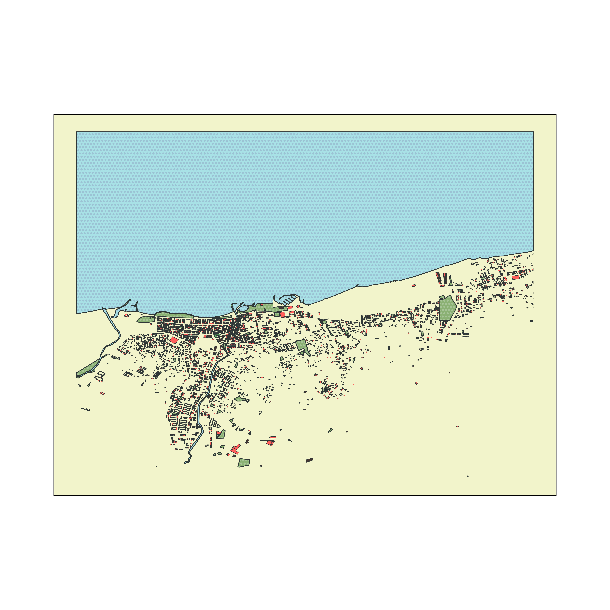

# Umap

A Python library for drawing customized maps from OpenStreetMap data. Create beautiful, minimalist maps with just a few lines of code.

## Features
- Create minimalist black and white maps with just coordinates and radius
- Draw customized maps from OpenStreetMap data with rich styling options
- Support for multiple map layers (buildings, streets, water bodies, etc.)
- High DPI output for crisp, clean lines
- Support for multiple map views with multiplot functionality
- Optional pen plotter support via vsketch

## Installation
```bash
pip install umap-osm
```

For development:
```bash
git clone https://github.com/U-C4N/Umap.git
cd Umap
pip install -e .
```

## Quick Start
```python
import umap

# Create a minimal map with just coordinates and radius
plot = umap.plot(
    (40.66, 29.28),  # Coordinates (latitude, longitude)
    radius=5000,     # Radius in meters
)

# Save the map
plot.fig.savefig('map.jpg', dpi=600, bbox_inches='tight')
```

## Documentation
- [Installation Guide](docs/installation.md)
- [Usage Guide](docs/usage.md) (English/Turkish)
- [API Reference](docs/api.md)

## Examples

### Minimal Black and White Map

```python
# examples/yalova_minimal.py
plot = umap.plot(
    (40.66, 29.28),  # Coordinates for Yalova
    radius=5000      # 5km radius
)
```

### Customized Colorful Map

```python
# examples/yalova_map.py
plot = umap.plot(
    (40.66, 29.28),
    layers={
        'water': {'tags': {'natural': ['water', 'bay']}},
        'green': {'tags': {'landuse': ['grass', 'park']}},
        'building': {'tags': {'building': True}}
    },
    style={
        'water': {'fc': '#a8e1e6', 'ec': '#2F3737'},
        'green': {'fc': '#8BB174', 'ec': '#2F3737'},
        'building': {'palette': ['#433633', '#FF5E5B']}
    }
)
```

## Default Style
When no style is provided, Umap uses a minimalist black and white style:
- Black lines (#000)
- White background and fills (#fff)
- Clean line weights (0.5px)
- Simple layer set (perimeter, streets, building)

## License
MIT License

## Author

<p align="left">
<b>Umutcan Edizaslan:</b>
<a href="https://github.com/U-C4N" target="blank"></a>
<a href="https://x.com/UEdizaslan" target="blank"></a>
<a href="https://discord.gg/2Tutcj6u" target="blank"></a>
</p>
