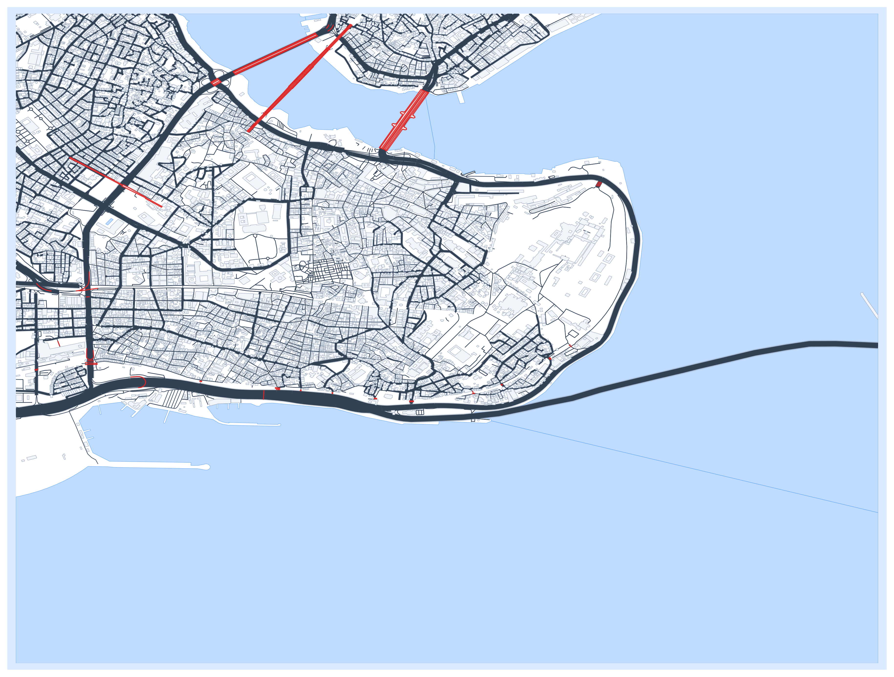
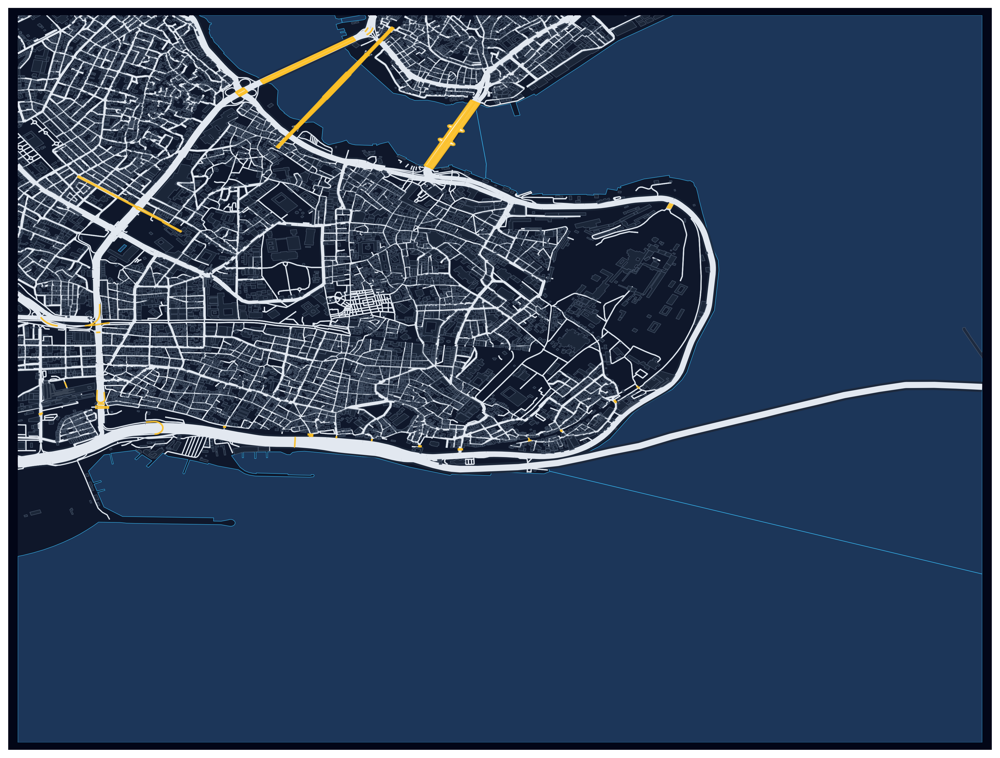

<p align="center">
  <h1 align="center">Umap</h1>
  <p align="center">
    Create beautiful, print-ready maps from OpenStreetMap data with a single command.
  </p>
</p>

<p align="center">
  <a href="#installation">Installation</a> •
  <a href="#quick-start">Quick Start</a> •
  <a href="#styles">Styles</a> •
  <a href="#python-api">Python API</a> •
  <a href="#configuration">Configuration</a>
</p>

---

## Styles

<table>
  <tr>
    <td align="center"><strong>Minimal</strong></td>
    <td align="center"><strong>Blueprint</strong></td>
    <td align="center"><strong>Vintage</strong></td>
  </tr>
  <tr>
    <td></td>
    <td></td>
    <td></td>
  </tr>
</table>

> All examples above: **Istanbul**, radius = 3000m

## Features

- **One-command maps** — `umap Istanbul` and you're done
- **Sea & land rendering** — Coastal cities render with proper water colors, not blank white
- **3 built-in styles** — Minimal, Blueprint, Vintage — or register your own
- **Smart optimization** — Detail level auto-adjusts based on map radius
- **Auto caching** — Repeated areas generate instantly from local cache
- **Multi-format export** — PNG, JPG, SVG, PDF
- **Python API** — Full programmatic control for custom workflows
- **Parallel data fetching** — Layers are fetched concurrently for speed

## Installation

```bash
pip install umap-osm
```

Or install from source:

```bash
git clone https://github.com/U-C4N/Umap.git
cd Umap
pip install -e .
```

**Requirements:** Python >= 3.8

## Quick Start

### CLI

```bash
# Just a city name
umap Istanbul

# Coordinates
umap --coords "48.8566,2.3522"

# Pick a style
umap Istanbul --style blueprint
umap Istanbul --style vintage

# Adjust radius (meters)
umap "New York" --radius 8000

# Export format
umap Istanbul --format svg --output istanbul.svg
```

### Style shortcuts

```bash
umap Istanbul --blueprint
umap Istanbul --vintage
umap Istanbul --minimal
```

## Python API

### Basic usage

```python
import umap

# Create a map
result = umap.plot("Istanbul", radius=3000, style="minimal")

# Save it
result.fig.savefig("istanbul.png", dpi=300, bbox_inches="tight")
```

### With extras (frame, north arrow, scale bar)

```python
import umap
from umap.utils.drawing import add_frame, add_north_arrow, add_scale_bar

result = umap.plot("Istanbul", radius=5000, style="vintage")

add_frame(result.ax)
add_north_arrow(result.ax)
add_scale_bar(result.ax, length_km=2)

result.fig.savefig("istanbul_full.png", dpi=300, bbox_inches="tight")
```

### Custom style

```python
import umap

my_style = {
    "sea":        {"fc": "#1a1a2e", "ec": "none", "zorder": -2},
    "land":       {"fc": "#16213e", "ec": "none", "zorder": -1},
    "background": {"fc": "#1a1a2e", "zorder": -2, "pad": 1.02},
    "streets":    {"ec": "#e94560", "lw": 0.8, "zorder": 4},
    "building":   {"ec": "#533483", "fc": "#0f3460", "lw": 0.3, "zorder": 5},
    "water":      {"ec": "#1a1a6e", "fc": "#162447", "lw": 0.3, "zorder": 2},
}

umap.register_style("cyberpunk", my_style)
result = umap.plot("Tokyo", radius=4000, style="cyberpunk")
result.fig.savefig("tokyo_cyberpunk.png", dpi=300, bbox_inches="tight")
```

### Multi-plot

```python
import umap

plots = umap.multiplot(
    umap.Subplot("Istanbul", radius=3000, style="minimal"),
    umap.Subplot("Paris",    radius=3000, style="blueprint"),
    figsize=(24, 12),
)
```

### Cache management

```python
import umap

# Check cache stats
info = umap.get_cache_info()
print(f"Cache: {info['file_count']} files, {info['total_size_mb']:.1f} MB")

# Clear old entries
removed = umap.clear_cache(older_than_days=3)
```

## Configuration

Create `~/.umap/config.yaml` for persistent defaults:

```yaml
default:
  style: minimal
  dpi: 300
  format: png
  cache_enabled: true
  radius: 5000
```

## How it works

```
Query (city name / coords)
    │
    ├── Geocode & create perimeter boundary
    │
    ├── Fetch layers in parallel (streets, buildings, water, bridges...)
    │
    ├── Smart filter by radius (remove noise, adjust detail)
    │
    ├── Cache results locally
    │
    └── Render with matplotlib
         ├── Sea background (blue)
         ├── Land perimeter (white / styled)
         ├── Water features (lakes, rivers)
         ├── Streets with casing
         ├── Buildings
         └── Bridges
```

## Project structure

```
umap/
├── __init__.py          # Public API exports
├── __main__.py          # python -m umap
├── cli.py               # Command-line interface
├── core/
│   ├── fetch.py         # OSM data fetching (parallel, cached)
│   └── plot.py          # Matplotlib rendering pipeline
└── utils/
    ├── cache.py          # Pickle-based local cache
    ├── drawing.py        # Frame, north arrow, scale bar, legend
    ├── optimization.py   # Radius-based detail filtering
    └── styles.py         # Built-in style definitions
```

## License

MIT License — see [LICENSE](LICENSE) for details.

---

<p align="center">
  Made by <a href="https://github.com/U-C4N">Umutcan Edizaslan</a>
</p>
