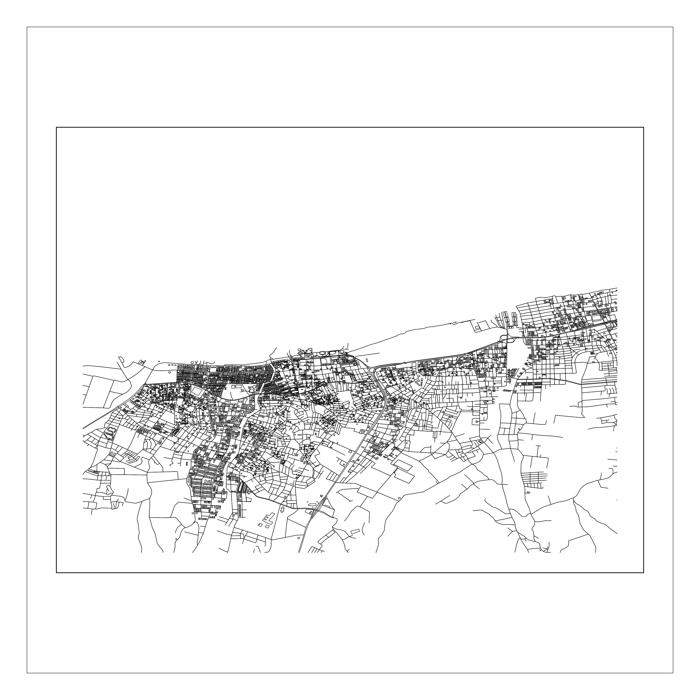
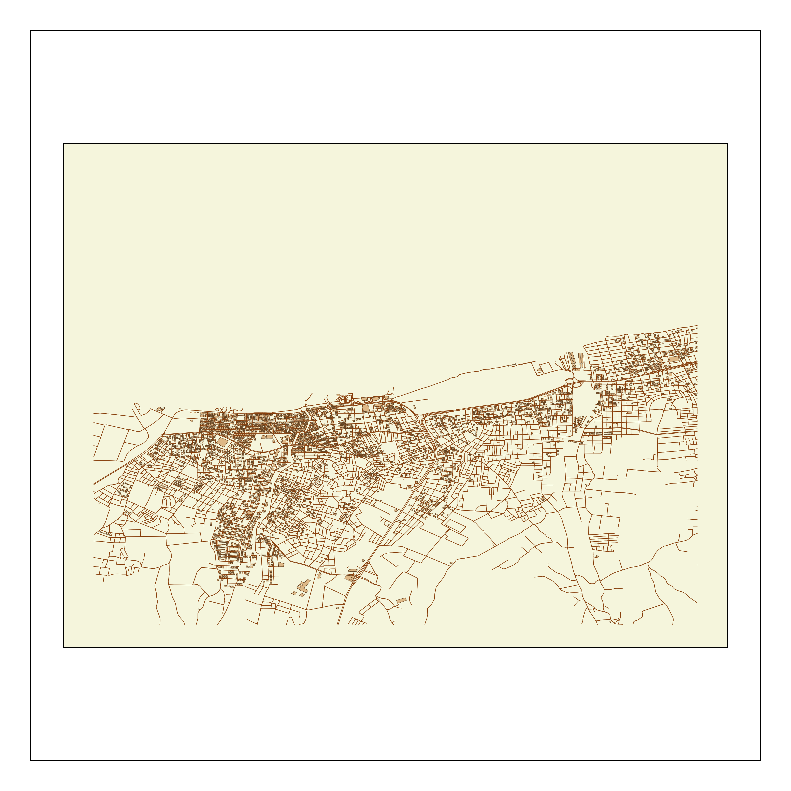

# Umap v3.0

A powerful Python library for creating beautiful, customized maps from OpenStreetMap data. Now with **CLI support**, **automatic caching**, and **smart optimization**!


*Minimal style map of Yalova created with CLI*

## 🚀 Key Features

- **🔧 Command Line Interface (CLI):** Create maps directly from your terminal.
- **💾 Automatic Caching:** Speeds up repeated map generation for the same area.
- **⚡ Auto Optimization:** Intelligently adjusts map details based on the requested radius.
- **🎨 Enhanced Styles:** Includes `minimal`, `blueprint`, and `vintage` styles out-of-the-box.
- **🔄 Batch Processing:** Generate multiple maps from a list of locations.
- **🐍 Python API:** Full programmatic control for advanced customization.

## Umap v3 Highlights

- **📣 Verbose Logging:** CLI commands now support `-v` and `-vv` for more detailed output.
- **📦 PyPI Packaging:** `pyproject.toml` metadata enables easy installation via `pip`.
- **🔖 Version Constant:** Access the library version with `umap.__version__`.

## Installation

```bash
# For users
pip install umap-osm

# For developers
git clone https://github.com/U-C4N/Umap.git
cd Umap
pip install -r requirements.txt
```

## 🔧 CLI Quick Start

```bash
# Create a minimal map of Yalova (5km radius)
python -m umap create --coords "40.66,29.28" --radius 5000 --style minimal --output yalova_minimal.png

# Create a blueprint style map of Yalova
python -m umap create --address "Yalova, Turkey" --radius 3000 --style blueprint --output yalova_blueprint.png

# Create a vintage style map with higher DPI
python -m umap create --coords "40.66,29.28" --radius 4000 --style vintage --dpi 600 --output yalova_vintage.png
```


*Blueprint style map of Yalova created with CLI*

### CLI Options

```bash
python -m umap create --help  # See all options for single map
python -m umap batch --help   # See all options for batch processing
# Increase verbosity with -v or -vv
python -m umap create --coords "40.66,29.28" -v
```

## 📚 Python API Example

```python
import umap

# Create and save a map
plot = umap.plot(
    (40.66, 29.28),  # Yalova coordinates
    radius=5000,
    style='vintage'  # Use a predefined style name or a custom style dict
)

if plot.fig:
    umap.add_frame(plot.ax) # Optional: Add a frame
    plot.fig.savefig('yalova_api_vintage.png', dpi=300, bbox_inches='tight')
```


*Vintage style map of Yalova created with Python API*

## 🎨 Styles

Umap comes with several built-in styles:
- `minimal`: Clean black & white.
- `blueprint`: Technical drawing look.
- `vintage`: Retro, old-map feel.

You can also define your own custom styles. See `umap/cli.py` for examples of style dictionaries.

## 💾 Caching & Optimization

- **Caching:** Data downloaded from OpenStreetMap is automatically cached in `~/.umap_cache` to speed up subsequent runs for the same area.
- **Optimization:** Map details (like road types shown or minimum building size) are automatically adjusted based on the map's radius for better performance and visual clarity.

## 🧪 Examples & Testing

Check the `examples/` directory:
- `yalova_styles.py`: Generates maps of Yalova in all predefined styles.
- `yalova_performance.py`: Benchmarks map generation for different radii.

Run them from the project root:
```bash
python examples/yalova_styles.py
python examples/yalova_performance.py
```

## 🔧 Development

Key modules:
- `umap/core/plot.py`: Core plotting logic.
- `umap/core/fetch.py`: Data fetching from OSM.
- `umap/cli.py`: Command Line Interface.
- `umap/utils/cache.py`: Caching mechanism.
- `umap/utils/optimization.py`: Performance and detail optimization.

## License
MIT License

## Author

<p align="left">
<b>Umutcan Edizaslan:</b>
<a href="https://github.com/U-C4N" target="blank"></a>
<a href="https://x.com/UEdizaslan" target="blank"></a>
<a href="https://discord.gg/2Tutcj6u" target="blank"></a>
</p>

---

**Umap v3.0** - Making beautiful maps easier than ever! 🗺️
