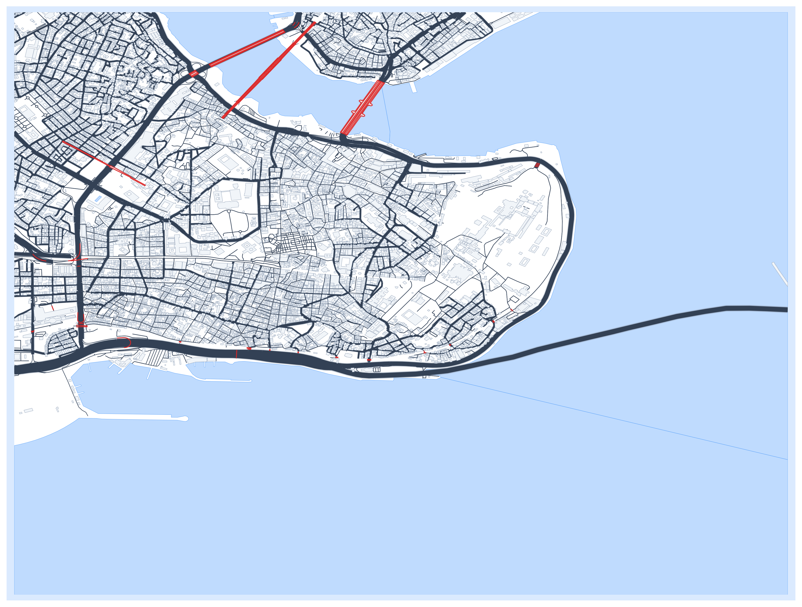
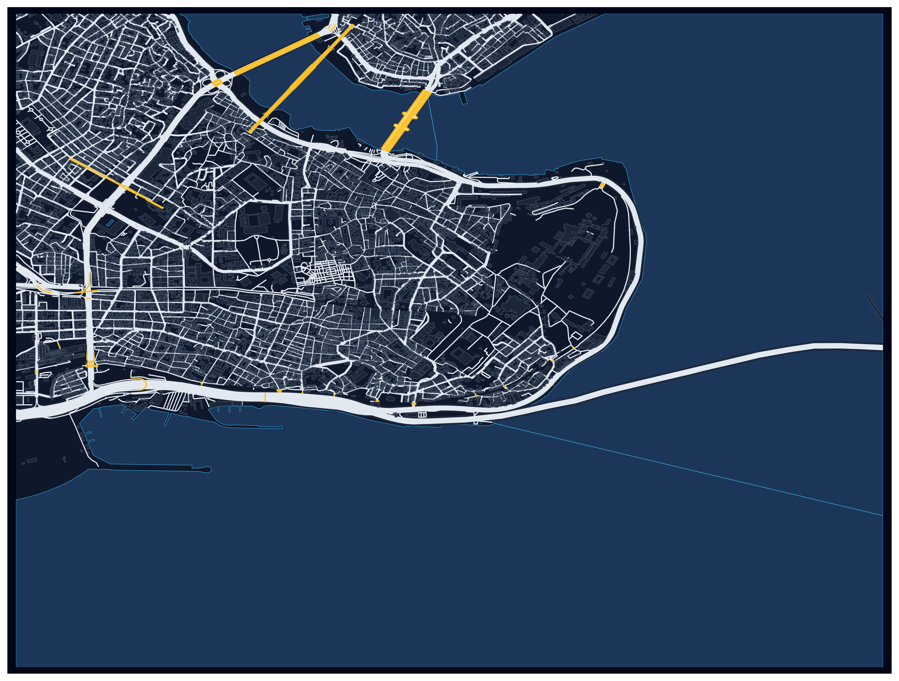

<p align="center">
  <h1 align="center">Umap</h1>
  <p align="center">
    Beautiful, print-ready city maps from OpenStreetMap — with a single command.
  </p>
</p>

---

## Styles

<table>
  <tr>
    <td align="center"><strong>Minimal</strong></td>
    <td align="center"><strong>Blueprint</strong></td>
    <td align="center"><strong>Vintage</strong></td>
  </tr>
  <tr>
    <td></td>
    <td></td>
    <td></td>
  </tr>
  <tr>
    <td align="center"><strong>Neon</strong></td>
    <td align="center"><strong>Papercraft (2.5D)</strong></td>
    <td></td>
  </tr>
  <tr>
    <td></td>
    <td></td>
    <td></td>
  </tr>
</table>

## Install

```bash
pip install umap-osm
```

## Your first map

```bash
umap Istanbul
```

That's it. A PNG appears in your current folder. First run downloads map data (1–3 min); repeats are instant thanks to caching.

## The commands you'll actually use

```bash
# Any city, town or address
umap Istanbul
umap "New York"
umap "Kadıköy, Istanbul"

# Exact location (lat,lon)
umap --coords "41.0082,28.9784"

# Pick a look
umap Istanbul --minimal      # clean & light (default)
umap Istanbul --blueprint    # dark technical drawing
umap Istanbul --vintage      # old-atlas colors
umap Istanbul --neon         # glowing night city
umap Istanbul --papercraft   # 2.5D paper-model buildings

# Poster mode: city name + coordinates footer
umap Istanbul --neon --poster

# Zoom level: radius in meters around the center
umap Istanbul --radius 1500   # neighborhood detail
umap Istanbul --radius 8000   # whole city

# Save with your own name
umap Istanbul --output my_map.png
```

## Getting truly high resolution

PNG/JPG are pixel images — every pixel image blurs if you zoom far enough.
Pick the right tool for your goal:

| Command | Output | Best for |
|---|---|---|
| `umap Istanbul --2k` | ~2600 px | phone wallpaper, social media |
| `umap Istanbul` | ~3900 px | desktop wallpaper |
| `umap Istanbul --4k` | ~5200 px | A2 poster print |
| `umap Istanbul --8k` | ~10400 px | large prints, deep zooming |
| `umap Istanbul --format svg` | vector | **infinite zoom, never blurs** |
| `umap Istanbul --format pdf` | vector | print shops |

**Rule of thumb:** printing or zooming a lot → use `--8k` or `--format svg`.

```bash
# Razor sharp at any zoom level:
umap Istanbul --neon --poster --format svg
```

Tip: `--papercraft` looks best with `--radius 2000` or less.

## Python API

```python
import umap

result = umap.plot("Istanbul", radius=3000, style="neon")
result.fig.savefig("istanbul.png", dpi=400, bbox_inches="tight",
                   facecolor="#04040c", pad_inches=0.5)
```

### Your own style

```python
import umap

my_style = {
    "sea":        {"fc": "#1a1a2e", "ec": "none", "zorder": -2},
    "land":       {"fc": "#16213e", "ec": "none", "zorder": -1},
    "background": {"fc": "#1a1a2e", "zorder": -2, "pad": 1.02},
    "green":      {"fc": "#12331f", "ec": "none", "zorder": 1},
    "streets":    {"ec": "#e94560", "lw": 0.8, "zorder": 4,
                   "glow": True, "glow_scale": 6.0},   # neon halo on any layer
    "building":   {"ec": "#533483", "fc": "#0f3460", "lw": 0.3, "zorder": 5},
    "water":      {"ec": "#1a1a6e", "fc": "#162447", "lw": 0.3, "zorder": 2},
}

umap.register_style("cyberpunk", my_style)
umap.plot("Tokyo", radius=4000, style="cyberpunk")
```

### 2.5D buildings in your style

Add an `extrude` block to the `building` layer and footprints rise up
using OSM floor-count data (see the `papercraft` style in
`umap/utils/styles.py` for all options):

```python
my_style["building"] = {
    "zorder": 5,
    "extrude": {"direction": 62, "scale": 0.0018, "default_levels": 2},
}
```

### Poster footer

```python
from umap.utils.drawing import add_frame, add_poster_layout, format_center_coords

result = umap.plot("Istanbul", radius=3000, style="vintage")
add_frame(result.ax)
add_poster_layout(result.ax, title="Istanbul",
                  subtitle=format_center_coords(result.ax))
```

### Several cities on one canvas

```python
plots = umap.multiplot(
    umap.Subplot("Istanbul", radius=3000, style="minimal"),
    umap.Subplot("Paris",    radius=3000, style="blueprint"),
    figsize=(24, 12),
)
```

### Cache

```python
umap.get_cache_info()               # size & file count
umap.clear_cache(older_than_days=3) # clean old entries
```

## Defaults file (optional)

Create `~/.umap/config.yaml` to skip repeating flags:

```yaml
default:
  style: neon
  format: png
  radius: 5000
  dpi: 300          # --2k/--4k/--8k override this
```

## License

MIT — see [LICENSE](LICENSE).

---

<p align="center">
  Made by <a href="https://github.com/U-C4N">Umutcan Edizaslan</a>
</p>
